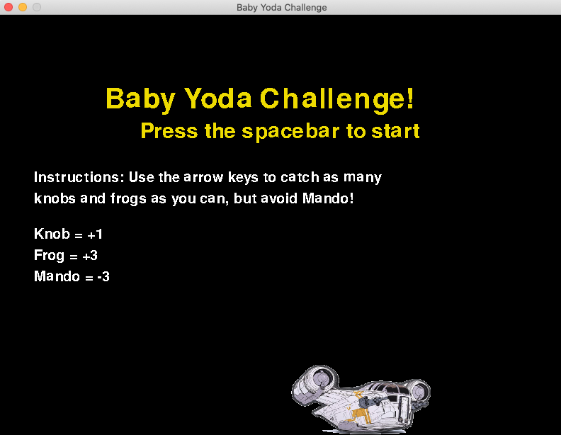
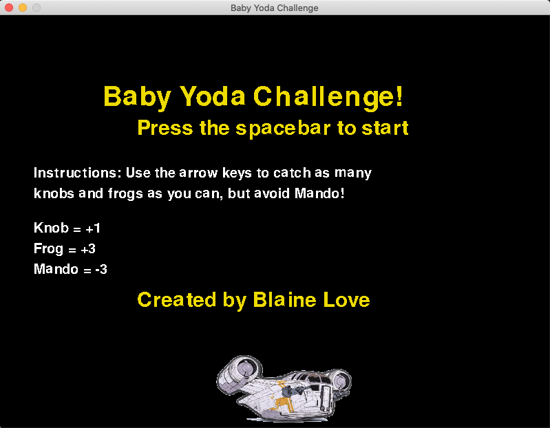
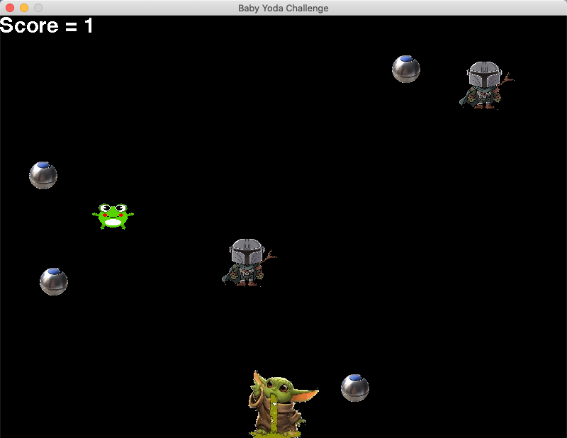

Baby Yoda Challenge is a video game developed using Python's [Pygame](https://www.pygame.org/docs/).

You are Baby Yoda and your goal is to catch as many knobs and frogs as possible while avoiding Mando. 

Player is greeted with the Star Wars theme song as a backdrop to their game play. Sprites also start falling at an increased rate as the game goes on, making it harder to avoid Mando.

Gameplay screenshots

Easter Egg (inspired by Warren Robinett's *Adventure* easter egg) when clicking Mando's ship as it drives by in the intro screen

")